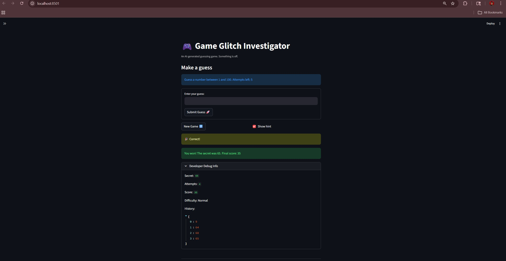

# 🎮 Game Glitch Investigator: The Impossible Guesser

## 🚨 The Situation

You asked an AI to build a simple "Number Guessing Game" using Streamlit.
It wrote the code, ran away, and now the game is unplayable. 

- You can't win.
- The hints lie to you.
- The secret number seems to have commitment issues.

## 🛠️ Setup

1. Install dependencies: `pip install -r requirements.txt`
2. Run the broken app: `python -m streamlit run app.py`

## 🕵️‍♂️ Your Mission

1. **Play the game.** Open the "Developer Debug Info" tab in the app to see the secret number. Try to win.
2. **Find the State Bug.** Why does the secret number change every time you click "Submit"? Ask ChatGPT: *"How do I keep a variable from resetting in Streamlit when I click a button?"*
3. **Fix the Logic.** The hints ("Higher/Lower") are wrong. Fix them.
4. **Refactor & Test.** - Move the logic into `logic_utils.py`.
   - Run `pytest` in your terminal.
   - Keep fixing until all tests pass!

## 📝 Document Your Experience

- [ ] Describe the game's purpose.
The purpose of the game is to guess a randomly generated secret number within a limited number of attempts. The player enters guesses through a Streamlit interface and receives feedback indicating whether the guess is too high, too low, or correct. The game tracks the number of attempts, the player’s score, and the history of guesses. Difficulty settings adjust the range of possible numbers and the number of attempts allowed.
- [ ] Detail which bugs you found.
Several issues were discovered when running the original application. First, the hint logic was reversed: when a guess was higher than the secret number, the game sometimes suggested going higher instead of lower. Second, the guess history list did not immediately update after submitting a guess and instead appeared one guess behind. Third, starting a new game did not properly reset all game state variables, such as the history list and score. These issues caused confusing gameplay behavior and inconsistent state tracking.
- [ ] Explain what fixes you applied.
To fix these issues, I corrected the higher/lower hint logic so that the messages matched the actual comparison with the secret number. I also adjusted the input handling by grouping the guess input and submit button inside a Streamlit form so guesses would register correctly without delayed updates. Additionally, I modified the "New Game" logic to reset all relevant session state variables, including attempts, score, history, and game status. Finally, I ensured the secret number was always compared as an integer instead of sometimes being converted to a string, which previously caused inconsistent comparisons.

## 📸 Demo

- 

## 🚀 Stretch Features

- [ ] [If you choose to complete Challenge 4, insert a screenshot of your Enhanced Game UI here]
